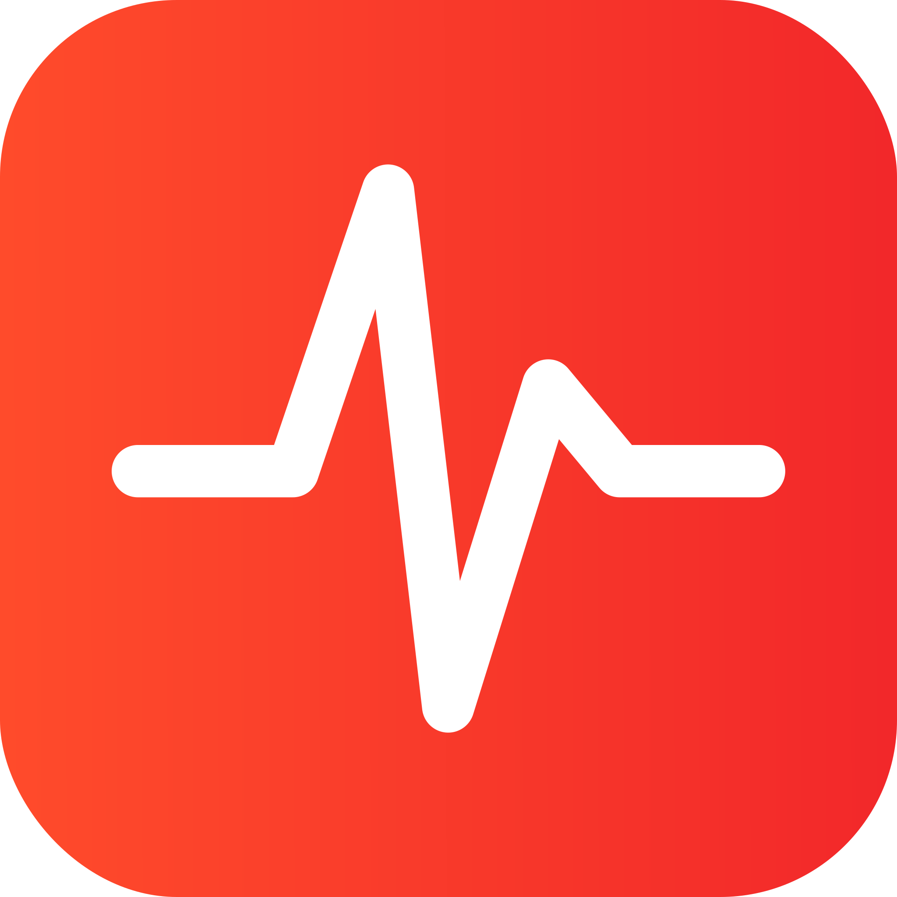

  
  # Secourisme
  &nbsp;
     
    
    

Welcome to the Secourisme project, an exciting initiative aiming to make first aid skills accessible to everyone. The goal is to provide a space where beginners, young learners, and experienced individuals can not only access essential first aid techniques but also stay updated on annual developments in the field.

## About the Project

### Main Objective

The mission is to democratize knowledge in first aid. The objective is to create a user-friendly and inclusive platform, allowing everyone to visualize and learn first aid techniques, stay informed about constant developments in the field, and maintain their skills over time.

### For Whom? ⛑️

- **Beginners:** If you're new to first aid, our site offers a clear and practical introduction to essential techniques.
  
- **Young Learners:** Explore crucial information interactively and educationally.

- **Experienced Individuals:** For those who have already undergone first aid training, our platform serves as a continuous resource, providing regular updates to maintain and enhance their skills.

## Features 🚀

- **Interactive Documentation:** Explore detailed guides with visual demonstrations of first aid techniques.
  
- **Annual Updates:** Stay informed about the latest advancements and recommendations in first aid.

- **Knowledge Memo:** A space for quick revision of essential techniques.

## How to Contribute 🤝

We believe in the power of collaboration. If you share our vision and want to contribute to making first aid accessible to everyone, check the [Contribution](#contribution) section in the README file.

Join us in this crucial mission to save lives by democratizing knowledge in first aid! 🌐🚑

## Support the Project ⭐

If you find this project useful or interesting, we encourage you to give it a ⭐️ on GitHub. It only takes a second but can greatly help increase the project's visibility.

If you're particularly excited about our mission to make first aid accessible to everyone, consider contributing further by [**becoming a contributor**](#how-to-contribute) or by sharing the project with your colleagues and friends.

Thank you very much for your support! 🌟

